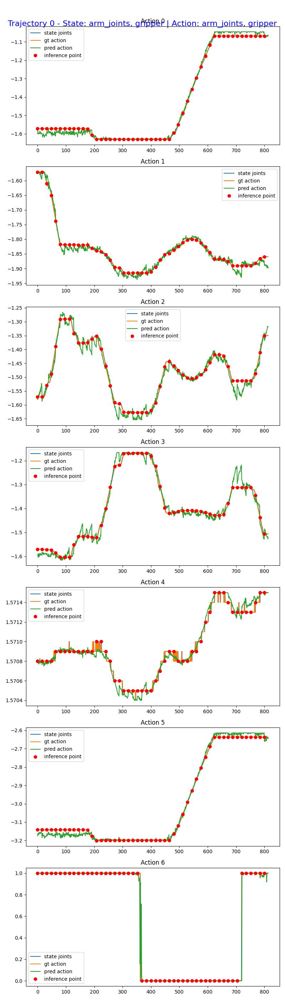
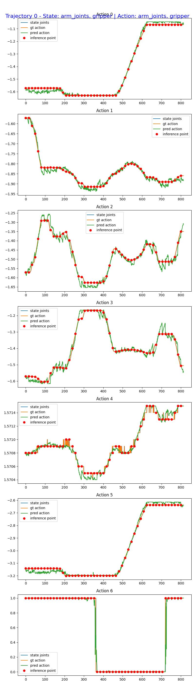

# GR00T N1.7 Checkpoint2 Open-Loop Evaluation on UR10e

This report documents the PyTorch and vla.cpp GGUF open-loop evaluations of a
CKA-pruned GR00T N1.7 checkpoint on one UR10e `pick up the cup` trajectory. The
procedure and report structure follow
[Step 4: Open Loop Evaluation in NVIDIA Isaac-GR00T](https://github.com/NVIDIA/Isaac-GR00T/blob/main/getting_started/finetune_new_embodiment.md#step-4-open-loop-evaluation).

Open-loop evaluation uses recorded data. At each inference point, the model
receives two camera views, the robot state, and the language instruction, then
predicts an action chunk that is compared with the ground-truth action. This is
not a closed-loop evaluation and does not directly measure task success on a
physical robot.

## 1. Evaluation Setup

| Component | Value |
| --- | --- |
| GPU | NVIDIA GeForce RTX 5060 Ti, 16,311 MiB |
| Isaac-GR00T revision | `376ba890cff8c9de64d71d982772a9c36185fdd7` |
| Checkpoint | `Luke99662244/checkpoint2` |
| Checkpoint revision | `7c4bdfe13690784aeb59a29f0142c43cd74072c4` |
| GGUF | `checkpoints/checkpoint2/checkpoint2-f32.gguf` |
| GGUF SHA-256 | `c37d3563df050d8a2307740e29a078968e17d4313b8490ed29593eb5ee3999be` |
| Dataset | `datasets/ur10e-cup-eval-v2` |
| Trajectory | `0` — `pick up the cup` |
| Frames | 814 |
| Action dimensions | 7 — 6 arm joints and 1 gripper |
| Camera views | `side`, `wrist` |
| Execution horizon | 16 |
| Denoising steps | 4 |
| Embodiment tag | `NEW_EMBODIMENT` |

The runtime checkpoint uses the following pruned architecture:

| Module | Original depth | Retained blocks |
| --- | ---: | ---: |
| Language backbone | 16 | 8 |
| Action DiT | 32 | 16 |
| VL self-attention | 4 | 4 |

## 2. Download and Verify the Checkpoint

The checkpoint was downloaded from the Hugging Face Hub at a pinned revision
to make the run reproducible:

```bash
cd /path/to/vla.cpp

./gr00t-openloop-work/Isaac-GR00T/.venv/bin/hf download \
    Luke99662244/checkpoint2 \
    --revision 7c4bdfe13690784aeb59a29f0142c43cd74072c4 \
    --exclude "checkpoint-6000/*" "checkpoint_quarantine/*" \
    --local-dir ./checkpoints/checkpoint2 \
    --max-workers 4
```

The two inference model shards occupy approximately 8.3 GiB in total. The
duplicate training checkpoint under `checkpoint-6000/`, including its optimizer
state, was excluded because it is not required for open-loop inference. The
verified SHA-256 checksums are:

```text
c52e9e957f8246b52ec1732a5402c7b10c541dfa9f834312ac9fb54dd301ab2f  model-00001-of-00002.safetensors
0cb9933bd1d841e00bac2da489a33f9c554d2d82a009939ffce95886515f1fe7  model-00002-of-00002.safetensors
```

Verify them again with:

```bash
sha256sum ./checkpoints/checkpoint2/model-*.safetensors
```

## 3. Run the Open-Loop Evaluation

The runner invokes NVIDIA's official `gr00t/eval/open_loop_eval.py` evaluator:

```bash
cd /path/to/vla.cpp

./eval/run_gr00t_n1d7_ur10e_openloop_remote.sh \
    --checkpoint ./checkpoints/checkpoint2 \
    --dataset ./datasets/ur10e-cup-eval-v2 \
    --output-dir ./openloop-output-checkpoint2 \
    --skip-setup
```

The corresponding evaluator command is:

```bash
python gr00t/eval/open_loop_eval.py \
    --dataset-path ./datasets/ur10e-cup-eval-v2 \
    --embodiment-tag NEW_EMBODIMENT \
    --model-path ./gr00t-openloop-work/runtime-checkpoint2-pruned \
    --traj-ids 0 \
    --execution-horizon 16 \
    --denoising-steps 4 \
    --steps 814 \
    --save-plot-path ./openloop-output-checkpoint2/traj_0.jpeg
```

Before evaluating the complete episode, a 32-frame smoke test was run with:

```bash
./eval/run_gr00t_n1d7_ur10e_openloop_remote.sh \
    --checkpoint ./checkpoints/checkpoint2 \
    --dataset ./datasets/ur10e-cup-eval-v2 \
    --output-dir ./openloop-output-checkpoint2 \
    --skip-setup \
    --steps 32
```

The smoke test achieved an MSE of `0.0001872359` and an MAE of `0.0096091190`
without a CUDA out-of-memory error.

### Run the GGUF directly with vla.cpp

The GGUF evaluator uses the same checkpoint processor and LeRobot trajectory
loader as the official evaluator. Python prepares processor-exact inputs and
decodes the action units; all model inference is performed by the persistent
`vla-openloop` C++ process:

```bash
python scripts/eval_gr00t_n1_7_gguf_openloop.py prepare \
    --checkpoint ./gr00t-openloop-work/runtime-checkpoint2-pruned \
    --dataset ./datasets/ur10e-cup-eval-v2 \
    --fixture ./gguf-openloop-checkpoint2/fixture \
    --steps 814 --execution-horizon 16 --seed 20260813

VLA_GR00T_GRAPH_CACHE=1 \
VLA_GR00T_BF16_WEIGHTS=1 \
VLA_GR00T_EMBODIMENT=new_embodiment \
./build-gguf-cuda/vla-openloop \
    --ckpt ./checkpoints/checkpoint2/checkpoint2-f32.gguf \
    --fixture ./gguf-openloop-checkpoint2/fixture \
    --actions ./gguf-openloop-checkpoint2/actions.f32

python scripts/eval_gr00t_n1_7_gguf_openloop.py score \
    --checkpoint ./gr00t-openloop-work/runtime-checkpoint2-pruned \
    --dataset ./datasets/ur10e-cup-eval-v2 \
    --fixture ./gguf-openloop-checkpoint2/fixture \
    --actions ./gguf-openloop-checkpoint2/actions.f32 \
    --output ./gguf-openloop-output-checkpoint2 \
    --gguf ./checkpoints/checkpoint2/checkpoint2-f32.gguf
```

## 4. Full-Episode Results

The evaluator processed all 814 frames, performed inference every 16 frames,
and completed without a traceback, CUDA out-of-memory error, or `NaN` value.

| Metric | Trajectory 0 | Average across all trajectories |
| --- | ---: | ---: |
| Unnormalized Action MSE | 0.0007250374 | 0.0007250374 |
| Unnormalized Action MAE | 0.0101807602 | 0.0101807602 |

Raw evaluator output:

```text
INFO:root:Using 814 steps (requested: 814, trajectory length: 814)
INFO:root:Unnormalized Action MSE across single traj: 0.000725037360098213
INFO:root:Unnormalized Action MAE across single traj: 0.0101807601749897
INFO:root:MSE for trajectory 0: 0.000725037360098213, MAE: 0.0101807601749897
INFO:root:Average MSE across all trajs: 0.000725037360098213
INFO:root:Average MAE across all trajs: 0.0101807601749897
INFO:root:Done
```

### vla.cpp GGUF result

The GGUF run used deterministic BF16 noise with seed `20260813`. It processed
the same 814 frames and 51 inference points without a runtime error or
non-finite action value.

| Metric | Trajectory 0 |
| --- | ---: |
| Unnormalized Action MSE | 0.0009261190 |
| Unnormalized Action MAE | 0.0113530281 |
| Mean latency, including warm-up | 69.21 ms/request |
| Median latency | 66.56 ms/request |
| Median vision time | 36.59 ms/request |
| Median action inference time | 28.34 ms/request |

The earlier PyTorch evaluator run sampled noise without a fixed seed, so its
trajectory MSE/MAE should not be treated as a bit-for-bit comparison with the
deterministic GGUF run. In the fixed-noise step-0 parity check, the first request
from this batch is byte-identical to the previously verified vla.cpp CUDA
output; that output had cosine similarity `0.99999487` to PyTorch over the seven
active action dimensions.

### Visualization: Ground-Truth and Predicted Actions

The orange curve is the ground-truth action, the green curve is the predicted
action, and the red dots mark inference points spaced 16 frames apart.



GGUF prediction:



## 5. Result Interpretation

- The predictions at inference points follow the ground-truth trends across all
  six arm joints and the gripper open/close state.
- The MSE and MAE above are action errors after converting values back to their
  original units, not errors computed on normalized actions.
- NVIDIA does not define one universal MSE threshold for every embodiment. The
  absolute value depends on the dataset, action scale, and modality
  configuration. Plot overlap and error trends across checkpoints are more
  informative than a single absolute score.
- This evaluation dataset contains only one recorded trajectory. The result
  confirms that the pipeline and checkpoint work on this trajectory, but it is
  not sufficient to establish generalization or closed-loop success on a
  physical robot.

For a stronger evaluation, run the same command on held-out episodes and compare
MSE and MAE across the original checkpoint, intermediate checkpoints, and the
pruned checkpoint.

## 6. Pruned-Checkpoint Compatibility

The checkpoint retains Action DiT blocks from non-contiguous original indices.
If runtime setup only changes `num_layers` from 32 to 24, upstream code rebuilds
the cross-attention and self-attention block types according to their new
indices. This produces the following shape mismatch:

```text
size mismatch for weight: copying a param with shape [1536, 1536]
from checkpoint, the shape in current model is [1536, 2048]
```

The runtime evaluator was extended with `block_indices` so that block parity and
the text/image attention schedule remain tied to the original indices recorded
in `cka_pruning_manifest`. The changes are located in:

```text
gr00t-openloop-work/Isaac-GR00T/gr00t/model/modules/dit.py
eval/run_gr00t_n1d7_ur10e_openloop_remote.sh
```

The source checkpoint was not modified. A symlink-based runtime view is created
at:

```text
gr00t-openloop-work/runtime-checkpoint2-pruned/
```

## 7. Output Artifacts

Output directory relative to the repository root:

```text
openloop-output-checkpoint2/
├── eval.log
├── gpu-after.txt
├── run-info.txt
└── traj_0.jpeg
```

The synchronized GGUF artifacts are stored separately:

```text
gguf-openloop-output-checkpoint2/
├── eval.log
├── inference.log
├── metrics.json
├── pred_actions.f32
├── timings.csv
└── traj_0.jpeg
```

- `eval.log`: complete evaluator log and metrics.
- `traj_0.jpeg`: ground-truth actions, predicted actions, and inference points.
- `run-info.txt`: revisions, checkpoint, dataset, and run parameters.
- `gpu-after.txt`: GPU state after evaluation.

Open the synchronized artifacts directly from this repository:

- [Trajectory 0 visualization](../openloop-output-checkpoint2/traj_0.jpeg)
- [Evaluation log](../openloop-output-checkpoint2/eval.log)
- [Run information](../openloop-output-checkpoint2/run-info.txt)
- [GPU state after evaluation](../openloop-output-checkpoint2/gpu-after.txt)
- [GGUF metrics](../gguf-openloop-output-checkpoint2/metrics.json)
- [GGUF inference log](../gguf-openloop-output-checkpoint2/inference.log)
- [GGUF timing samples](../gguf-openloop-output-checkpoint2/timings.csv)
- [GGUF trajectory visualization](../gguf-openloop-output-checkpoint2/traj_0.jpeg)

Extract the metrics with:

```bash
grep -E 'MSE|MAE|Average' ./openloop-output-checkpoint2/eval.log
```
