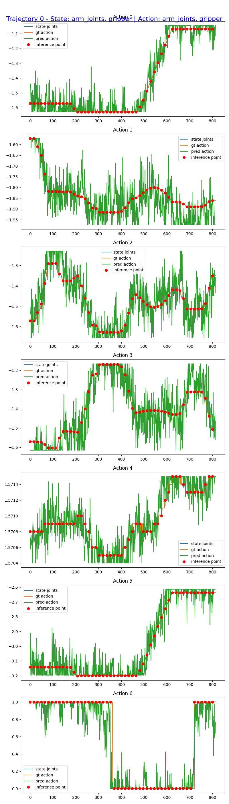

# GR00T N1.7 Open-Loop Evaluation on UR10e

This report documents the open-loop evaluation of a CKA-pruned GR00T N1.7
checkpoint on one UR10e `pick up the cup` trajectory. The procedure and report
structure follow
[Step 4: Open Loop Evaluation in NVIDIA Isaac-GR00T](https://github.com/NVIDIA/Isaac-GR00T/blob/main/getting_started/finetune_new_embodiment.md#step-4-open-loop-evaluation).

Open-loop evaluation uses recorded data. At each inference point, the model
receives two camera views, the robot state, and the language instruction, then
predicts an action chunk that is compared with the ground-truth action. This is
not a closed-loop evaluation and does not directly measure task success on a
physical robot.

## 1. Evaluation Setup

| Component | Value |
| --- | --- |
| Host | `huy-X670E-Steel-Legend` |
| GPU | NVIDIA GeForce RTX 5060 Ti, 16,311 MiB |
| Python | 3.12.3 |
| PyTorch | 2.9.0+cu128 |
| TorchCodec | 0.8.1 |
| FFmpeg | 7.1.1, installed in an isolated work directory |
| Isaac-GR00T revision | `376ba890cff8c9de64d71d982772a9c36185fdd7` |
| Checkpoint | `duc996/checkpoint1` |
| Checkpoint revision | `79336b156696d298b04c03903834439af935ad9b` |
| Dataset | `datasets/ur10e-cup-eval-v2` |
| Trajectory | `0` — `pick up the cup` |
| Frames | 814 |
| Action dimensions | 7 — 6 arm joints and 1 gripper |
| Camera views | `side`, `wrist` |
| Execution horizon | 16 |
| Denoising steps | 4 |
| Embodiment tag | `NEW_EMBODIMENT` |

The runtime checkpoint uses the following pruned architecture:

| Module | Original depth | Retained blocks |
| --- | ---: | ---: |
| Language backbone | 16 | 12 |
| Action DiT | 32 | 24 |
| VL self-attention | 4 | 4 |

## 2. Download and Verify the Checkpoint

The checkpoint was downloaded from the Hugging Face Hub at a pinned revision
to make the run reproducible:

```bash
cd /home/huy/vla.cpp

gr00t-openloop-work/Isaac-GR00T/.venv/bin/hf download \
    duc996/checkpoint1 \
    --revision 79336b156696d298b04c03903834439af935ad9b \
    --local-dir checkpoints/checkpoint1 \
    --max-workers 4
```

The two model shards occupy approximately 7.5 GiB in total. Their verified
SHA-256 checksums are:

```text
0036dd5e74b48fab5453c512b8aad3d667f421c144dfae1aa66e11a8c3360236  model-00001-of-00002.safetensors
29e765feb7a47715533d95251bae4c295eb3a02a18c5a283f60d7dba72ba54a8  model-00002-of-00002.safetensors
```

Verify them again with:

```bash
sha256sum checkpoints/checkpoint1/model-*.safetensors
```

## 3. Run the Open-Loop Evaluation

The runner invokes NVIDIA's official `gr00t/eval/open_loop_eval.py` evaluator:

```bash
ssh workstation
export PATH="$HOME/.local/bin:$PATH"
cd /home/huy/vla.cpp

./eval/run_gr00t_n1d7_ur10e_openloop_remote.sh \
    --checkpoint /home/huy/vla.cpp/checkpoints/checkpoint1 \
    --dataset /home/huy/vla.cpp/datasets/ur10e-cup-eval-v2 \
    --skip-setup
```

The corresponding evaluator command is:

```bash
python gr00t/eval/open_loop_eval.py \
    --dataset-path /home/huy/vla.cpp/datasets/ur10e-cup-eval-v2 \
    --embodiment-tag NEW_EMBODIMENT \
    --model-path /home/huy/vla.cpp/gr00t-openloop-work/runtime-checkpoint1-pruned \
    --traj-ids 0 \
    --execution-horizon 16 \
    --denoising-steps 4 \
    --steps 814 \
    --save-plot-path /home/huy/vla.cpp/openloop-output/traj_0.jpeg
```

Before evaluating the complete episode, a 32-frame smoke test was run with:

```bash
./eval/run_gr00t_n1d7_ur10e_openloop_remote.sh \
    --checkpoint /home/huy/vla.cpp/checkpoints/checkpoint1 \
    --dataset /home/huy/vla.cpp/datasets/ur10e-cup-eval-v2 \
    --skip-setup \
    --steps 32
```

The smoke test achieved an MSE of `0.0032055245` and an MAE of `0.0369618833`
without a CUDA out-of-memory error.

## 4. Full-Episode Results

The evaluator processed all 814 frames, performed inference every 16 frames,
and completed without a traceback, CUDA out-of-memory error, or `NaN` value.

| Metric | Trajectory 0 | Average across all trajectories |
| --- | ---: | ---: |
| Unnormalized Action MSE | 0.0069466881 | 0.0069466881 |
| Unnormalized Action MAE | 0.0463428348 | 0.0463428348 |

Raw evaluator output:

```text
INFO:root:Using 814 steps (requested: 814, trajectory length: 814)
INFO:root:Unnormalized Action MSE across single traj: 0.006946688052266836
INFO:root:Unnormalized Action MAE across single traj: 0.04634283483028412
INFO:root:MSE for trajectory 0: 0.006946688052266836, MAE: 0.04634283483028412
INFO:root:Average MSE across all trajs: 0.006946688052266836
INFO:root:Average MAE across all trajs: 0.04634283483028412
INFO:root:Done
```

### Visualization: Ground-Truth and Predicted Actions

The orange curve is the ground-truth action, the green curve is the predicted
action, and the red dots mark inference points spaced 16 frames apart.



## 5. Result Interpretation

- The predictions at inference points follow the ground-truth trends across all
  six arm joints and the gripper open/close state.
- The MSE and MAE above are action errors after converting values back to their
  original units, not errors computed on normalized actions.
- NVIDIA does not define one universal MSE threshold for every embodiment. The
  absolute value depends on the dataset, action scale, and modality
  configuration. Plot overlap and error trends across checkpoints are more
  informative than a single absolute score.
- This evaluation dataset contains only one recorded trajectory. The result
  confirms that the pipeline and checkpoint work on this trajectory, but it is
  not sufficient to establish generalization or closed-loop success on a
  physical robot.

For a stronger evaluation, run the same command on held-out episodes and compare
MSE and MAE across the original checkpoint, intermediate checkpoints, and the
pruned checkpoint.

## 6. Pruned-Checkpoint Compatibility

The checkpoint retains Action DiT blocks from non-contiguous original indices.
If runtime setup only changes `num_layers` from 32 to 24, upstream code rebuilds
the cross-attention and self-attention block types according to their new
indices. This produces the following shape mismatch:

```text
size mismatch for weight: copying a param with shape [1536, 1536]
from checkpoint, the shape in current model is [1536, 2048]
```

The runtime evaluator was extended with `block_indices` so that block parity and
the text/image attention schedule remain tied to the original indices recorded
in `cka_pruning_manifest`. The changes are located in:

```text
gr00t-openloop-work/Isaac-GR00T/gr00t/model/modules/dit.py
eval/run_gr00t_n1d7_ur10e_openloop_remote.sh
```

The source checkpoint was not modified. A symlink-based runtime view is created
at:

```text
gr00t-openloop-work/runtime-checkpoint1-pruned/
```

## 7. Output Artifacts

Results on the workstation:

```text
/home/huy/vla.cpp/openloop-output/
├── eval.log
├── gpu-after.txt
├── run-info.txt
└── traj_0.jpeg
```

- `eval.log`: complete evaluator log and metrics.
- `traj_0.jpeg`: ground-truth actions, predicted actions, and inference points.
- `run-info.txt`: revisions, checkpoint, dataset, and run parameters.
- `gpu-after.txt`: GPU state after evaluation.

Open the synchronized artifacts directly from this repository:

- [Trajectory 0 visualization](../openloop-output/traj_0.jpeg)
- [Evaluation log](../openloop-output/eval.log)
- [Run information](../openloop-output/run-info.txt)
- [GPU state after evaluation](../openloop-output/gpu-after.txt)

Extract the metrics with:

```bash
grep -E 'MSE|MAE|Average' openloop-output/eval.log
```

The results were also copied to the controller machine at:

```text
/home/linh/vla.cpp-openloop-output-checkpoint1/
```
