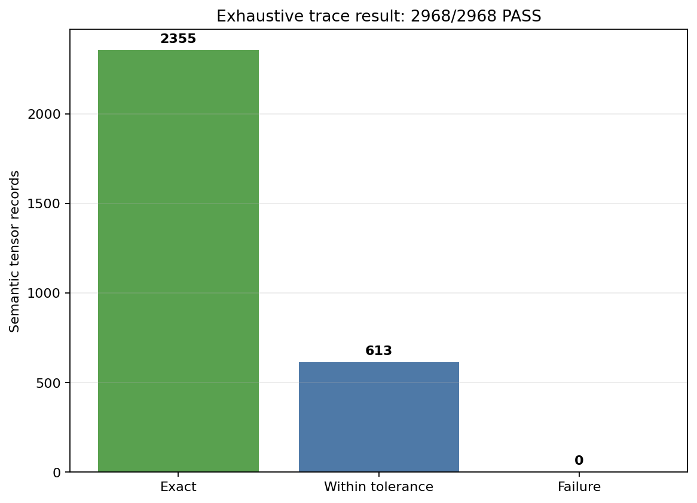
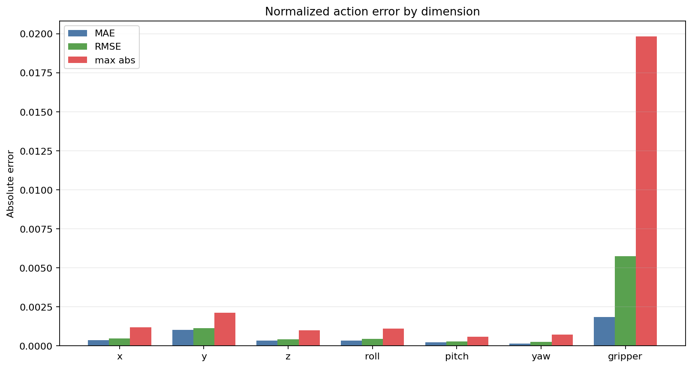
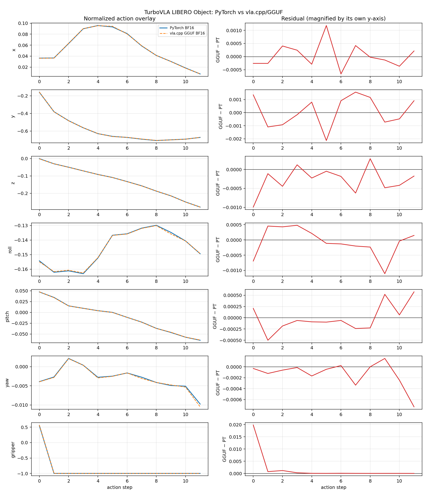
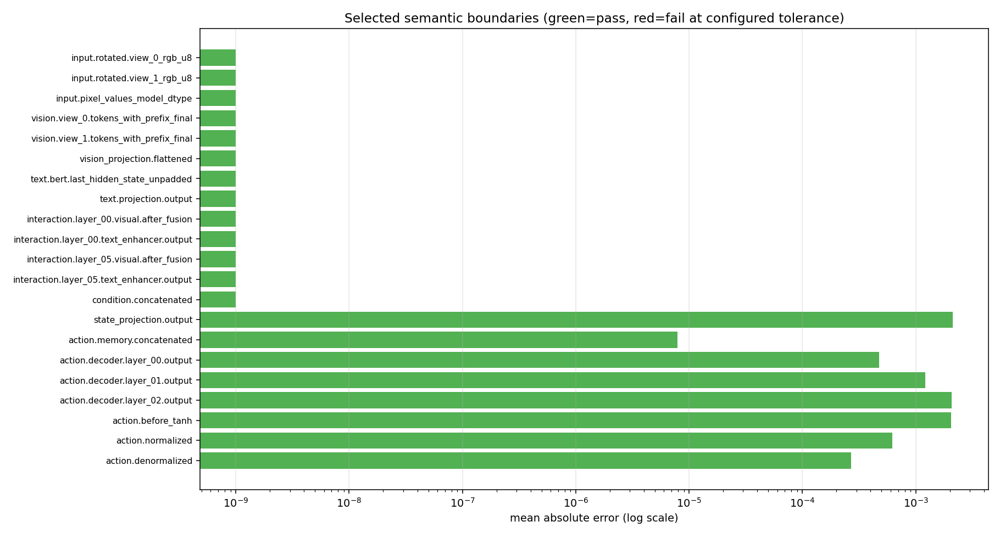
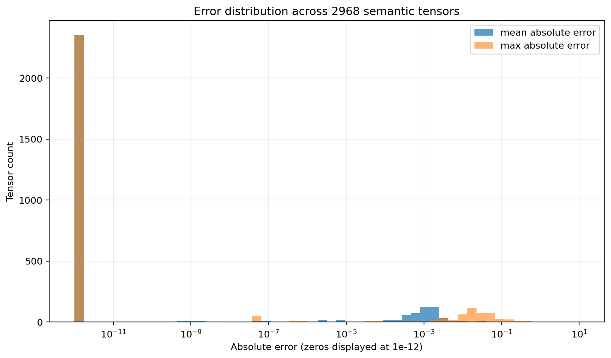
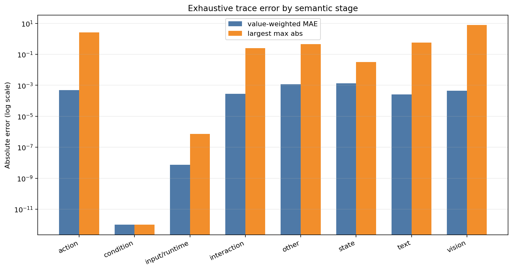
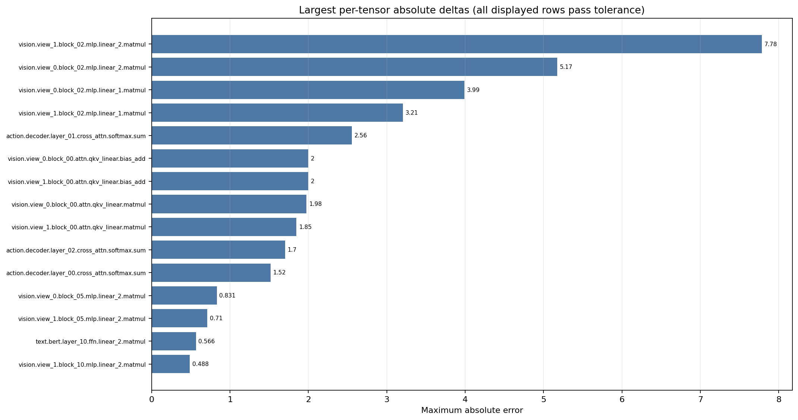
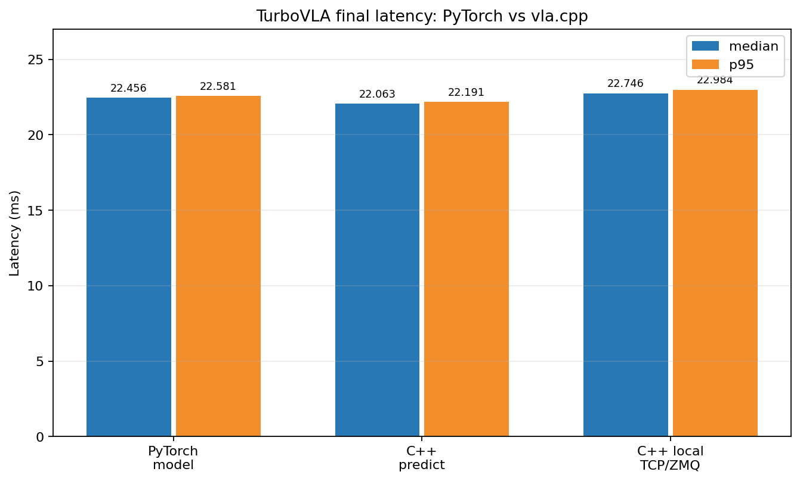

# TurboVLA: PyTorch vs vla.cpp Final Report

Finalized: 2026-08-10  
GPU: NVIDIA GeForce RTX 3050 6 GB Laptop GPU  
Driver: 580.173.02

## 1. Executive summary

The optimized CUDA production path in `vla.cpp` is faster than the PyTorch BF16
model forward on the fixed LIBERO fixture while preserving output parity.

| Result | Value |
|---|---:|
| PyTorch synchronized forward median | 22.456 ms |
| C++ server `predict()` median | **22.063 ms** |
| C++ latency reduction vs PyTorch | **1.75%** |
| C++ speedup vs PyTorch | **1.018x** |
| Exhaustive semantic parity | **2968/2968 PASS** |
| Production fused action contract | **2/2 PASS** |

The local TCP/ZMQ client-wall median is 22.746 ms. It includes 0.684 ms of
loopback transport, Protobuf, ZMQ, and Python client overhead that is absent
from the in-process PyTorch measurement. The model-speed claim therefore uses
C++ server `predict()` rather than client-wall latency.

## 2. Correctness and trace parity

### 2.1. Test fixture

| Field | Value |
|---|---|
| Fixture | LIBERO Object, task 0, episode 0, step 0, seed 7 |
| Task | `pick_up_the_alphabet_soup_and_place_it_in_the_basket` |
| Output shape | `1 x 12 x 7` |
| Precision | PyTorch BF16 vs GGUF BF16 on CUDA |
| PyTorch checkpoint SHA256 | `787c01bd8b328a5948b756aab92f8058a1e0802845a0e1f24506291b9cda59cf` |
| GGUF checkpoint SHA256 | `8c893202e3466f50e369653d5206391c0a001ff9aaf991342164680eb7c1e6fb` |
| Tolerance | `atol=0.05`, `rtol=0.05` |

### 2.2. Trace levels

- `boundary`: model inputs, stage outputs, and final outputs.
- `layer`: every BERT, DINOv3, interaction, and action-decoder layer output.
- `op`: projections, attention heads, logits, probabilities, residuals,
  normalization outputs, FFN activations, and projections.
- `exhaustive`: the smallest shared semantic level. It additionally records
  decomposed linear matmul/bias tensors, layer-normalization statistics,
  softmax max/shift/exp/sum tensors, masks, reshapes, aliases, and named Fusion
  intermediates.

CUDA registers, warp-local partials, cuBLAS workspaces, and other kernel-private
state are not part of the shared trace contract.

### 2.3. Exhaustive gate

Records are matched by `(semantic_name, call_index)` with `--require-all`.

| Check | Result |
|---|---:|
| PyTorch exhaustive records | 2968 |
| C++ exhaustive records | 2968 |
| Semantic overlap | 2968 |
| Exact matches | 2355 |
| Matches within tolerance | 613 |
| Failures | 0 |
| Missing in C++ | 0 |
| Missing in PyTorch | 0 |
| Full exhaustive gate | **PASS** |
| Fast `model-op-v1` gate | **1111/1111 PASS** |

The C++ total consists of 2934 model-internal records and 34 runtime replay
records. Of all records, 2355 are bit-identical and 613 differ numerically but
satisfy `abs_error <= atol + rtol * abs(reference)` for every value.



### 2.4. Final outputs

| Output | MAE | RMSE | Max abs | Pearson | Gate |
|---|---:|---:|---:|---:|---:|
| `action.normalized` | 0.000619 | 0.002236 | 0.019836 | 0.999982 | **PASS** |
| `action.denormalized` | 0.000269 | 0.000465 | 0.001997 | 0.999999 | **PASS** |

| Dimension | MAE | RMSE | Max abs | Pearson |
|---|---:|---:|---:|---:|
| x | 0.000372 | 0.000470 | 0.001183 | 0.999882 |
| y | 0.001017 | 0.001129 | 0.002130 | 0.999975 |
| z | 0.000342 | 0.000428 | 0.000992 | 0.999993 |
| roll | 0.000354 | 0.000458 | 0.001108 | 0.999527 |
| pitch | 0.000236 | 0.000299 | 0.000575 | 0.999972 |
| yaw | 0.000161 | 0.000255 | 0.000732 | 0.998268 |
| gripper | 0.001852 | 0.005741 | 0.019836 | 1.000000 |





### 2.5. Production fused path

Exhaustive debug mode materializes the BF16 decomposition required to compare
all PyTorch-named intermediates. Production mode instead dispatches fused CUDA
attention and epilogues.

The observable production output contract passes both records:

| Production output | Max abs | Gate |
|---|---:|---:|
| `action.normalized` | 0.040951 | **PASS** |
| `action.denormalized` | 0.002648 | **PASS** |

A diagnostic comparison that forces fused production results into the eager
2968-record decomposition reports 1911 passes and 1057 failures. This is not a
production gate because the fused kernel has no one-to-one representation of
the eager reduction order or kernel-private intermediates. The certified gates
are the complete semantic decomposition in debug mode and the observable action
outputs in production mode.

### 2.6. Error analysis









The largest absolute delta is 7.784180 at
`vision.view_1.block_02.mlp.linear_2.matmul`. It passes because the reference
magnitude at that location satisfies the configured relative tolerance. Full
per-tensor metrics are retained in
[`compare.csv`](artifacts/parity/exhaustive/compare.csv) and
[`compare.json`](artifacts/parity/exhaustive/compare.json).

## 3. Latency

### 3.1. Final measurements

Each backend used 20 untimed warm-up calls followed by 100 timed calls. Tracing
was disabled.

| Backend and scope | Mean (ms) | Median (ms) | p95 (ms) | p99 (ms) |
|---|---:|---:|---:|---:|
| PyTorch synchronized model forward | 22.456 | 22.456 | 22.581 | 22.743 |
| C++ server `predict()` | 22.069 | **22.063** | 22.191 | 22.260 |
| C++ client wall, local TCP/ZMQ | 22.732 | 22.746 | 22.984 | 23.019 |



### 3.2. Final phase timings

| C++ phase | Median (ms) |
|---|---:|
| Vision | 14.988 |
| Inference after vision | 7.062 |
| Total `predict()` | **22.063** |

The PyTorch vision encoder/projector median is 13.201 ms. C++ vision is 13.54%
slower, while the complete C++ model path is 1.75% faster.

### 3.3. Timing scope

- PyTorch timing uses `torch.cuda.synchronize()` around the forward. It starts
  from preprocessed BF16 pixels and state and includes instruction tokenization.
- C++ server `predict()` starts from rotated RGB, token IDs, and normalized
  state. It includes image normalization and both CUDA graphs.
- C++ client-wall timing additionally includes local TCP, Protobuf, ZMQ, and
  Python response handling.

The model scopes are close but not identical; the TCP/ZMQ result is reported
separately to avoid presenting RPC overhead as model latency.

## 4. Implemented optimizations

- Persistent cuDNN patch-embedding handles, descriptors, workspaces, and device
  outputs across requests.
- Persistent ggml contexts and allocators.
- Device-to-device vision-to-main transfer, removing the GPU-to-CPU-to-GPU
  boundary.
- Fused CUDA attention dispatch, RoPE, and head-layout handling.
- Fused BF16 bias, residual, scale, GELU, and rounding epilogues.
- Removal of redundant rounding and materialization operations.
- Direct use of BF16 layer-normalization and flash-attention outputs.
- Optimized planar image normalization.
- Direct borrowing of Protobuf RGB buffers instead of a server-side image copy.
- Zero-copy pyzmq send and receive in the benchmark harness.
- BF16-aware trace reading/writing and equal-coverage exhaustive records.
- An `action-output-v1` contract for production fused outputs.

## 5. Build and checkpoint conversion

### 5.1. CUDA build

```bash
cmake -S . -B build -DGGML_CUDA=ON \
  -DCMAKE_CUDA_ARCHITECTURES=86 -DCMAKE_BUILD_TYPE=Release
cmake --build build -j --target vla-server vla-cli
```

### 5.2. LIBERO GGUF conversion

```bash
PYTHONPATH=build/_deps/llama-src/gguf-py \
  /home/linh/anaconda3/envs/turbovla-libero/bin/python \
  scripts/convert_turbovla_to_gguf.py \
  --ckpt /home/linh/Desktop/TurboVLA/pretrained/TurboVLA/checkpoints/libero/object.pth \
  --out /home/linh/Desktop/TurboVLA/pretrained/TurboVLA/checkpoints/libero/object-bf16.gguf \
  --outtype bf16
```

Use `spatial.pth`, `goal.pth`, or `long.pth` for the other LIBERO suites.

### 5.3. ALOHA GGUF conversion

```bash
PYTHONPATH=build/_deps/llama-src/gguf-py \
  /home/linh/anaconda3/envs/turbovla-libero/bin/python \
  scripts/convert_turbovla_to_gguf.py \
  --ckpt checkpoints/turbovla/DuyBao44DOCer-TurboVLA/finetune_step_5000.pth \
  --out checkpoints/turbovla/DuyBao44DOCer-TurboVLA/finetune_step_5000-bf16.gguf \
  --outtype bf16
```

State mean/std and action min/max are stored in `turbovla.*` GGUF metadata. The
converter also writes a `.stats.json` sidecar for Python clients.

### 5.4. One-shot inference

```bash
./build/vla-cli \
  --ckpt checkpoints/turbovla/DuyBao44DOCer-TurboVLA/finetune_step_5000-bf16.gguf \
  --image /path/to/camera_0_256.png \
  --image /path/to/camera_1_256.png \
  --tokens 101,4060,1996,4874,1012,102 \
  --state 0,0,0,0,0,0,0 --pretty
```

Normalize state with `(state - mean) / (std + 1e-6)`. Convert normalized action
back with `(action + 1) / 2 * (action_max - action_min) + action_min`.

## 6. Evaluation and deployment

### 6.1. ALOHA simulation

```bash
bash eval/sim/aloha/setup_aloha_sim.sh
cmake --build build --target vla-server -j
eval/run_turbovla_aloha.sh --episodes 1
```

The runner uses the pinned `google-deepmind/aloha_sim` environment. The 7-D
left-arm checkpoint action is mapped to the official 14-D control vector. A
successful episode requires the carrot to be supported inside the cup after
the gripper releases and moves away.

### 6.2. ALOHA open-loop evaluation

```bash
bash eval/sim/aloha/setup_aloha_sim.sh
eval/run_turbovla_aloha_openloop.sh
```

The evaluator samples anchors every 12 frames from recorded camera data and
compares the predicted `[12, 7]` chunk with recorded absolute joint actions.

### 6.3. Physical ALOHA

Start the inference server:

```bash
eval/run_turbovla_aloha_server.sh
```

Run the ROS2 client after sourcing ROS2 and the Interbotix workspace:

```bash
VLA_ADDR=tcp://INFERENCE_HOST:5555 eval/run_turbovla_aloha_client.sh
```

This checkpoint controls only the left arm and does not support `--dual-arm`.
Keep the robot workspace clear and retain direct access to the hardware
emergency stop during initial rollouts.

### 6.4. LIBERO

Start the server:

```bash
./build/vla-server \
  --bind tcp://127.0.0.1:5555 \
  /home/linh/Desktop/TurboVLA/pretrained/TurboVLA/checkpoints/libero/object-bf16.gguf
```

Run the client:

```bash
eval/sim/libero/libero_uv/.venv/bin/python \
  eval/client/run_sim_client_direct.py \
  --arch turbovla --task libero_object --task-id 0 \
  --tokenizer /home/linh/Desktop/TurboVLA/pretrained/bert-base-uncased \
  --n-action-steps 12 --n-episodes 1
```

The aligned protocol executes all 12 predicted actions before requesting the
next chunk. Use `--n-action-steps 1` only as a closed-loop ablation.

## 7. Reproducing the trace gates

The raw traces were removed during output cleanup, but all retained comparisons
can be regenerated from the same fixture.

### 7.1. PyTorch exhaustive trace

```bash
cd /home/linh/Desktop/TurboVLA
/home/linh/anaconda3/envs/turbovla-libero/bin/python \
  scripts/run_fixture_inference.py \
  --fixture outputs/pytorch_reference_baselines/<baseline>/fixture \
  --checkpoint /path/to/model.pth \
  --dinov3-path pretrained/dinov3/dinov3-vitb16 \
  --bert-path pretrained/bert-base-uncased \
  --stats-path pretrained/TurboVLA/libero_all4_stats.json \
  --stats-key libero_all4_no_noops --device cuda --precision bf16 \
  --trace-root /path/on/disk/pytorch-trace --trace-level exhaustive
```

### 7.2. C++ exhaustive trace

```bash
cd /run/media/linh/Data/Shared2OS/vla.cpp
eval/sim/libero/libero_uv/.venv/bin/python \
  scripts/run_turbovla_cpp_trace.py \
  --fixture /home/linh/Desktop/TurboVLA/outputs/pytorch_reference_baselines/<baseline>/fixture \
  --vla-cli build/vla-cli --gguf /path/to/model-bf16.gguf \
  --stats-path /home/linh/Desktop/TurboVLA/pretrained/TurboVLA/libero_all4_stats.json \
  --stats-key libero_all4_no_noops \
  --trace-root /path/on/disk/cpp-trace --trace-level exhaustive
```

### 7.3. Full semantic comparison

```bash
eval/sim/libero/libero_uv/.venv/bin/python \
  scripts/compare_turbovla_traces.py \
  --reference /path/on/disk/pytorch-trace/forward_000000_rank_0 \
  --candidate /path/on/disk/cpp-trace/forward_000000_rank_0 \
  --output /path/on/disk/comparison \
  --atol 0.05 --rtol 0.05 --require-all
```

For a faster regression gate, use `op` traces with
`--contract model-op-v1 --require-all`. For fused production outputs, use
`--contract action-output-v1 --require-all`.

### 7.4. Scalar pytest gate

```bash
VLA_TURBOVLA_REFERENCE_TRACE=/path/to/pytorch/forward_000000_rank_0 \
VLA_TURBOVLA_CANDIDATE_TRACE=/path/to/cpp/forward_000000_rank_0 \
VLA_TURBOVLA_TRACE_ATOL=0.05 VLA_TURBOVLA_TRACE_RTOL=0.05 \
VLA_TURBOVLA_TRACE_REQUIRE_ALL=1 \
pytest -q tests/py/test_turbovla_trace_values.py
```

### 7.5. Tensor inspection

```bash
python scripts/inspect_turbovla_trace.py \
  /path/to/cpp/forward_000000_rank_0 \
  --name vision.view_0.block_00.attn.softmax.probs \
  --output-npy /path/on/disk/block00_probs.npy
```

An `op` trace is approximately 0.9 GB. The verified exhaustive traces were
approximately 2.4 GB for PyTorch and 1.6 GB for C++. Keep
`VLA_TURBOVLA_TRACE_MAX_FORWARDS=1` while debugging.

## 8. Final validation

- `vla-cli` and `vla-server` builds: PASS.
- C++ `ctest`: 1/1 PASS.
- Trace-value tests: 12 passed, 2 environment-dependent skips.
- ALOHA integration tests: 4 passed, 1 skip.
- `git diff --check`: PASS.

## 9. Retained artifacts

### Latency

- [PyTorch latency](artifacts/latency/pytorch.json)
- [PyTorch vision latency](artifacts/latency/pytorch_vision.json)
- [Final C++ latency](artifacts/latency/cpp_final_tcp_zerocopy_borrowed.json)

### Parity

- [Exhaustive summary](artifacts/parity/exhaustive/summary.json)
- [Exhaustive per-tensor CSV](artifacts/parity/exhaustive/compare.csv)
- [Exhaustive per-tensor JSON](artifacts/parity/exhaustive/compare.json)
- [Production action summary](artifacts/parity/production_action/summary.json)
- [Production action comparison](artifacts/parity/production_action/compare.json)
- [Production fused diagnostic](artifacts/parity/production_fused/summary.json)
- [Report data](artifacts/parity/report_data.json)

### Figures

The report contains eight figures under [`figures/`](figures/). Six aggregate
figures can be regenerated with:

```bash
eval/sim/libero/libero_uv/.venv/bin/python \
  scripts/generate_turbovla_final_report_charts.py \
  reports/turbovla_final
```
